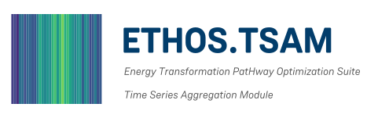

<!-- markdownlint-disable line-length no-inline-html -->

<!-- logo:header:start -->
<p align="center">
  <a href="https://tsam.readthedocs.io/">
    <picture>
      <source media="(prefers-color-scheme: dark)" srcset="./docs/assets/tsam-logo-dark.svg">
      
    </picture>
  </a>
  &nbsp;&nbsp;
  <a href="https://www.fz-juelich.de/en/ice/ice-2">
    <picture>
      <source media="(prefers-color-scheme: dark)" srcset="https://raw.githubusercontent.com/FZJ-IEK3-VSA/README_assets/v.1.0.0/ICE2_Logos/JSA-Header-dark.svg">
      
    </picture>
  </a>
</p>
<!-- logo:header:end -->

# ETHOS.TSAM - Time Series Aggregation Module

**Time series aggregation for large optimization models — and any other time series.**

[](https://pypi.python.org/pypi/tsam)
[](https://anaconda.org/conda-forge/tsam)
[](https://github.com/FZJ-IEK3-VSA/tsam/actions/workflows/ci-develop.yaml)
[](https://codecov.io/gh/FZJ-IEK3-VSA/tsam)
[](https://tsam.readthedocs.io/en/latest/)
[](https://github.com/FZJ-IEK3-VSA/tsam/blob/develop/LICENSE.txt)

<!-- readme-only:start -->
📖 **Read the full documentation at [tsam.readthedocs.io](https://tsam.readthedocs.io/).**
<!-- readme-only:end -->

ETHOS.TSAM is a python package which uses different machine learning algorithms for the aggregation of time series. The data aggregation can be performed in two freely combinable dimensions: By representing the time series by a user-defined number of typical periods or by decreasing the temporal resolution.
ETHOS.TSAM was originally designed for reducing the computational load for large-scale energy system optimization models by aggregating their input data, but is applicable for all types of time series, e.g., weather data, load data, both simultaneously or other arbitrary groups of time series.

ETHOS.TSAM is part of the [Energy Transformation PatHway Optimization Suite (ETHOS) at ICE-2](https://www.fz-juelich.de/de/ice/ice-2/leistungen/model-services). It is tightly integrated into [ETHOS.FINE](https://github.com/FZJ-IEK3-VSA/FINE) to reduce the temporal complexity of energy system models.

## Features
* flexible handling of multidimensional time-series via the pandas module
* different aggregation methods implemented (averaging, k-means, exact k-medoids, hierarchical, k-maxoids, k-medoids with contiguity), which are based on scikit-learn, or self-programmed with pyomo
* hypertuning of aggregation parameters to find the optimal combination of the number of segments inside a period and the number of typical periods
* novel representation methods, keeping statistical attributes, such as the distribution
* flexible integration of extreme periods as own cluster centers
* weighting for the case of multidimensional time-series to represent their relevance

## Installation

To avoid dependency conflicts, it is recommended that you install ETHOS.TSAM in its own environment. You can use either [uv](https://docs.astral.sh/uv/)  or [conda/mamba](https://conda-forge.org/download/) to manage environments and installations. Before proceeding, you must install either UV or Conda/Mamba, or both.

**Quick Install with uv**

```bash
uv venv tsam_env
source .venv/bin/activate  # On Windows: .venv\Scripts\activate
uv pip install tsam
```

Or from conda-forge:

```bash
conda create -n tsam_env -c conda-forge tsam
```

conda and mamba can be used interchangeably

### Development Installation

```bash
git clone https://github.com/FZJ-IEK3-VSA/tsam.git
cd tsam
```

#### Using uv (recommended)

```bash
uv venv
source .venv/bin/activate  # On Windows: .venv\Scripts\activate
uv pip install -e ".[develop]"
```

#### Using conda-forge

```bash
conda env create -n tsam_env --file=environment.yml
conda activate tsam_env
pip install -e . --no-deps
```

#### Set up pre-commit hooks

```bash
pre-commit install
```

See [CONTRIBUTING.md](CONTRIBUTING.md) for detailed development guidelines.

### MILP Solver for k-medoids

[HiGHS](https://github.com/ERGO-Code/HiGHS) is installed by default. For better performance on large problems, commercial solvers (Gurobi, CPLEX) are recommended if you have a license


## Getting Started

### Basic workflow

A small example how ETHOS.TSAM can be used is described as follows:
```python
import pandas as pd
import tsam
```

Read in the time series data set with pandas
```python
raw = pd.read_csv('testdata.csv', index_col=0, parse_dates=True)
```

Run the aggregation - specify the number of typical periods and configure clustering/segmentation options:
```python
from tsam import aggregate, ClusterConfig, SegmentConfig

result = tsam.aggregate(
    raw,
    n_clusters=8,
    period_duration='24h',  # or 24, '1d'
    cluster=ClusterConfig(
        method='hierarchical',
        representation='distribution_minmax',
    ),
    segments=SegmentConfig(n_segments=8),
)
```

Access the results:
```python
# Get the typical periods DataFrame
cluster_representatives = result.cluster_representatives

# Check accuracy metrics
print(f"RMSE: {result.accuracy.rmse.mean():.4f}")

# Reconstruct the original time series from typical periods
reconstructed = result.reconstructed

# Save results
cluster_representatives.to_csv('cluster_representatives.csv')
```

### Coming from version 2 or 3?

The class-based `TimeSeriesAggregation` API has been **removed in version 4** — use
`tsam.aggregate()` as shown above. The
[**migration guide**](https://tsam.readthedocs.io/en/latest/migration-guide/) maps every old
parameter, method, and default to its replacement.

### Detailed examples

The documentation is built around runnable notebooks:

* [**Your first aggregation**](https://tsam.readthedocs.io/en/latest/tutorials/quickstart/) — the whole workflow end to end, as a Jupyter notebook.
* [**Optimization workflow**](https://tsam.readthedocs.io/en/latest/how-to/optimization_workflow/) — how to access the aggregation results needed to parameterize e.g. an optimization.

The example time series are based on a department [publication](https://www.mdpi.com/1996-1073/10/3/361) and the [test reference years of the DWD](https://www.dwd.de/DE/leistungen/testreferenzjahre/testreferenzjahre.html).


## Citation

If you want to use ETHOS.TSAM in a published work, **please kindly cite**:
* Hoffmann et al. (2022):\
[**The Pareto-Optimal Temporal Aggregation of Energy System Models**](https://www.sciencedirect.com/science/article/abs/pii/S0306261922004342)


## Further reading

The full list of publications behind ETHOS.TSAM and the aggregation methods it implements —
with open-access links — is kept in one place in the documentation:
[**Further reading**](https://tsam.readthedocs.io/en/latest/explanation/further-reading/).


## Contributions and Support
All contributions are welcome:
- If you have a question, want to report a bug, or have a feature request, please open an [Issue](https://github.com/FZJ-IEK3-VSA/tsam/issues/new). We will then take care of the issue as soon as possible.
- If you want to contribute with additional features or code improvements, open a [Pull request](https://github.com/FZJ-IEK3-VSA/tsam/pulls).

See [CONTRIBUTING.md](CONTRIBUTING.md) for development guidelines.


## License

[MIT License](LICENSE.txt)


## About Us

We are the <a href="https://www.fz-juelich.de/en/ice/ice-2">Institute of Climate and Energy Systems – Jülich Systems Analysis (ICE-2)</a> at the <a href="https://www.fz-juelich.de/en"> Forschungszentrum Jülich</a>.
Our work focuses on independent, interdisciplinary research in energy, bioeconomy, infrastructure, and sustainability. We support a just, greenhouse gas–neutral transformation through open models and policy-relevant science.


## Code of Conduct
Please respect our [code of conduct](https://github.com/FZJ-IEK3-VSA/README_assets/blob/main/CODE_CONDUCT.md).


## Acknowledgments

This work is supported by the Helmholtz Association under the Joint Initiative ["Energy System 2050 – A Contribution of the Research Field Energy"](https://www.helmholtz.de/en/research/energy/energy_system_2050/) and the program ["Energy System Design"](https://www.esd.kit.edu/index.php) and within the [BMWi/BMWk](https://www.bmwk.de/Navigation/DE/Home/home.html) funded project [**METIS**](https://www.fz-juelich.de/de/ice/ice-2/projekte/metis).

<p align="left">
  <!-- logo:helmholtz:start -->
  <a href="https://www.helmholtz.de/en/">
    <picture>
      <source media="(prefers-color-scheme: dark)" srcset="https://raw.githubusercontent.com/FZJ-IEK3-VSA/README_assets/v.1.0.0/Helmholtz_Logos/Helmholtz-Logo-White-RGB.svg">
      
    </picture>
  </a>
  <!-- logo:helmholtz:end -->
</p>
