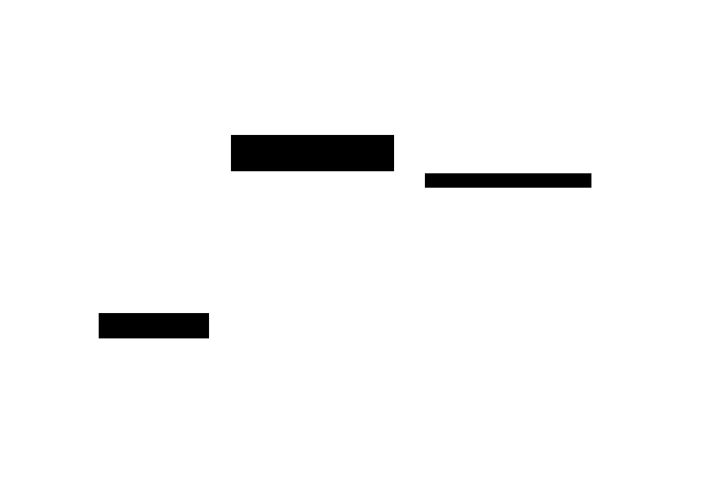

# System Context

The diagram below shows tsam in its environment: *who uses it, what it touches, and what it produces*.

## Context diagram

## Actors

| Actor | Role |
|-------|------|
| **Energy-system modeler / data scientist** | Primary user. Provides input data, chooses aggregation parameters, consumes results. |
| **Downstream optimization framework** | Consumes the typical periods (and weights) as input to an energy-system optimization model. Common examples: [ETHOS.FINE](https://github.com/FZJ-IEK3-VSA/FINE), [flixopt](https://github.com/flixOpt/flixopt), [oemof](https://oemof.org/). tsam does **not** call these frameworks; the user does. |
| **MILP solver** | Optional. Required only for the `k_medoids_exact` clustering method, which formulates clustering as an integer program. Other methods (`hierarchical`, `k_means`, `k_medoids`, `k_maxoids`, ...) need no external solver. |

## Boundaries

- tsam **does not** read files directly. The user is responsible for loading data into a `pandas.DataFrame`.
- tsam **does not** call downstream optimization frameworks. The user passes the aggregated result onward.
- tsam **does not** persist results. Returned objects are in-memory; the user serializes them as needed.

## When this diagram changes

Update this page if:

- A new actor is introduced (e.g. a CLI, a web service, an autotuner that calls tsam in a loop).
- tsam gains a direct integration with an external system (e.g. file I/O, a remote solver service).
- The library's scope changes (e.g. tsam starts producing optimization model artifacts directly).

Otherwise, this view is stable.
