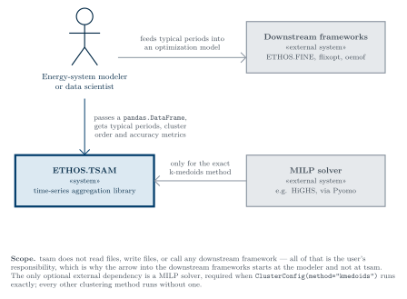

# System Context

The diagram below shows ETHOS.TSAM in its environment: who uses it, what it touches, and what it produces.

ETHOS.TSAM is a Python library used directly by an **energy-system modeler or data scientist**. The user loads time series data into a `pandas.DataFrame`, calls `tsam.aggregate()`, and receives a set of typical periods in return. tsam does not read files, write files, or call any downstream framework — all of that is the user's responsibility.

The **downstream optimization framework** (e.g. [ETHOS.FINE](https://github.com/FZJ-IEK3-VSA/FINE), [flixopt](https://github.com/flixOpt/flixopt), [oemof](https://oemof.org/)) consumes the aggregated result, but tsam has no knowledge of it.

The only optional external dependency is a **MILP solver**, required when `ClusterConfig(method="kmedoids")` is used. All other clustering methods run without an external solver.

## Methodological positioning

[Hoffmann et al. (2020)](https://www.mdpi.com/1996-1073/13/3/641) classify time-series aggregation methods along two axes (their **Table 3**): *how* periods are merged — **time-based** (by position on the time axis) vs **feature-based** (by similarity) — and *what form* the result takes — a **resolution variation** (fewer, coarser steps) or a set of **typical periods**:

|                   | Resolution variation    | Typical periods            |
|-------------------|-------------------------|----------------------------|
| **Time-based**    | Downsampling *(pandas)* | Time slices / averaging ✅ |
| **Feature-based** | Segmentation ✅         | **Clustering** ✅ *(core)* |

tsam covers the **feature-based** row and the typical-periods column. Its core is **clustering** of periods into typical periods (`kmeans`, `kmedoids`, `kmaxoids`, `hierarchical`); it also implements **segmentation** (merging adjacent time steps), time-based **averaging** of periods (the `averaging` and `contiguous` methods), and **extreme-period** handling. **Downsampling** is intentionally left out — it is a one-liner on the input (`df.resample(...)`), so you coarsen the series with pandas before handing it to tsam rather than asking tsam to do it. tsam also never performs *cross-sectional grouping of time series* (a separate branch in the review's Figure 4): it preserves the input's dimensionality, so an `N`-attribute series stays `N`-attribute throughout.

Within feature-based clustering, the review's three steps (§3.2.2) map directly onto the [pipeline](pipeline_guide.md):

| Hoffmann et al. (2020), §3.2.2 | tsam pipeline |
|--------------------------------|---------------|
| 3.2.2.1 Preprocessing and Normalization | Phase 1 — normalize, then unstack into periods |
| 3.2.2.2 Algorithms, Distance Metrics, Representation | Phase 2 — cluster centers (method · distance · representation) |
| 3.2.2.3 Rescaling | Phase 2 — optional `preserve_column_means` |

For the equations behind each step, see the [Mathematical Background](../math.md); for the full data flow, the [Pipeline Guide](pipeline_guide.md).
