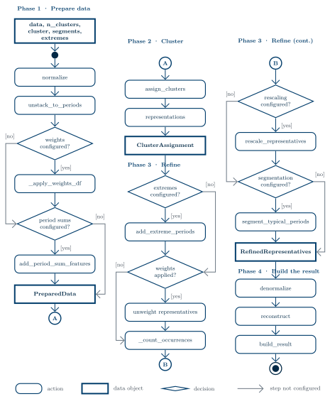
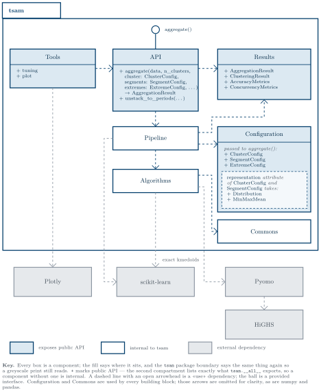

# Pipeline Guide

When you call [`tsam.aggregate()`][tsam.aggregate] it builds a configuration and
hands off to `run_pipeline()`, which runs the aggregation in **four phases**:

1. **Prepare data** — normalize the input and reshape it into clustering candidates.
2. **Cluster** — group the periods and pick a representative for each.
3. **Refine** — the optional adjustments: extremes, rescaling, segmentation.
4. **Build the result** — denormalize, rebuild the series, pack the result object.

Phases 2 and 3 are split along what is mandatory and what is not: phase 2 is
the one step every aggregation takes, and everything a caller can switch on or
off sits in phase 3.

This page is the stable conceptual map of that flow. Each phase below names the
*stage functions* it runs and links to their full reference — the precise
signatures, parameters, and behavior live in the auto-generated
[API reference](../../../reference/api/index.md), which tracks the code. The public input and
output types live in the API reference —
[Configuration](../../../reference/api/configuration.md) and [Results](../../../reference/api/results.md).

---

## Overview

The diagram below is the runtime view of a full [`aggregate()`][tsam.aggregate]
call: every stage in the order it runs, with the milestone dataclass handed from
one phase to the next, and a guard on each stage that runs only when the caller
configures it. Phases 1 and 2 are the left column, Phases 3 and 4 the right.



For the static side — which modules exist and what depends on what — see the
building block view:



!!! note "Relation to Hoffmann et al. (2020)"

    Phases 1–3 implement the three *feature-based merging* steps from the
    time-series-aggregation review by
    [Hoffmann et al. (2020)](https://www.mdpi.com/1996-1073/13/3/641):
    **Preprocessing and Normalization** (Phase 1), **Algorithms, Distance Metrics,
    Representation** (Phase 2), and **Rescaling** (Phase 3 step 4b).
    Phase 4 then reconstructs and packages the result. See
    [Methodological positioning](context.md#methodological-positioning) for how tsam
    sits in the review's overall taxonomy.

---

## Entry points

Two ways in, both ending in `run_pipeline()`:

**[`tsam.aggregate()`][tsam.aggregate]** — the primary API. It validates inputs,
derives `n_timesteps_per_period` from `period_duration / temporal_resolution`,
and calls `run_pipeline()`. See its [API reference][tsam.aggregate] for all
parameters.

```python
result = tsam.aggregate(df, n_clusters=8, period_duration=24)
```

**[`ClusteringResult.apply()`][tsam.result.ClusteringResult]** — reuse a fitted
clustering on new data, skipping clustering in favor of the stored assignments:

```python
result1 = tsam.aggregate(df_wind, n_clusters=8)
result2 = result1.clustering.apply(df_all)
```

---

## Phase 1 — Prepare data

Turns the raw input into the candidate matrix the clustering stage consumes
(steps 1–2, plus optional `2a` / `2b`). Orchestrated by
[`prepare_data`][tsam.pipeline.orchestrator.prepare_data].

1. **Normalize** — scale every column to `[0, 1]` so no column dominates the
   distance. → [`normalize`][tsam.pipeline.normalize.normalize]
2. **Unstack to periods** — reshape the flat series into a
   `(period x timestep-feature)` matrix. →
   [`unstack_to_periods`][tsam.pipeline.periods.unstack_to_periods]
- **2a · Apply weights** *(optional, `weights`)* — bake per-column weights into
  a copy of the candidates so they influence clustering distance only.
- **2b · Add period-sum features** *(optional, `include_period_sums`)* — append
  per-period column sums as extra distance-only features. →
  [`add_period_sum_features`][tsam.pipeline.periods.add_period_sum_features]

**Milestone →** [`PreparedData`][tsam.pipeline.types.PreparedData] — normalized
data, period profiles, the candidate matrix, and the weight vector.

## Phase 2 — Cluster

Groups the periods and picks a representative for each (step 3). This is the
one phase every aggregation runs in full — nothing in it is optional.
Orchestrated by
[`cluster_candidates`][tsam.pipeline.orchestrator.cluster_candidates].

3. **Cluster centers** — group periods and pick a representative for each. →
   [`cluster_periods`][tsam.pipeline.clustering.cluster_periods] (the
   [duration-curve][tsam.pipeline.clustering.cluster_sorted_periods] and
   [transfer][tsam.pipeline.clustering.use_predefined_assignments] variants
   handle `use_duration_curves` and `ClusteringResult.apply()`). Any period-sum
   features are trimmed back off the representatives afterwards, which stay in
   weighted space for the extreme detection that follows.

**Milestone →** [`ClusterAssignment`][tsam.pipeline.types.ClusterAssignment] —
representatives, cluster order, and center indices.

## Phase 3 — Refine

Applies everything that can still change *which* periods are represented or
*what* they contain (step 4, plus optional `4a` / `4b` / `4c`). Every stage here
is switchable; with no extremes, no rescaling and no segmentation the phase only
unweights and counts. Orchestrated by
[`refine_representatives`][tsam.pipeline.orchestrator.refine_representatives].

- **4a · Add extremes** *(optional, [`ExtremeConfig`][tsam.config.ExtremeConfig])*
  — inject extreme-value periods so peaks and troughs survive. →
  [`add_extreme_periods`][tsam.pipeline.extremes.add_extreme_periods]
4. **Unweight · count** — divide the weights back out, count cluster
   occurrences, and correct the padded last period's weight.
- **4b · Rescale** *(optional, `preserve_column_means`)* — scale non-extreme
  centers so their occurrence-weighted means match the original totals. →
  [`rescale_representatives`][tsam.pipeline.rescale.rescale_representatives]
- **4c · Segment** *(optional, [`SegmentConfig`][tsam.config.SegmentConfig])* —
  merge adjacent timesteps within each period into fewer segments. →
  [`segment_typical_periods`][tsam.pipeline.segmentation.segment_typical_periods]

**Milestone →**
[`RefinedRepresentatives`][tsam.pipeline.types.RefinedRepresentatives] — the
final typical periods, still normalized, plus occurrence counts and the
extreme/rescale/segmentation metadata.

## Phase 4 — Build the result

Expresses the refined representatives in the user's units and packs them up
(steps 5–7). Nothing here changes the aggregation any more. Orchestrated by
[`build_result`][tsam.pipeline.orchestrator.build_result].

5. **Denormalize** — convert the representatives back to the user's units. →
   [`denormalize`][tsam.pipeline.normalize.denormalize]
6. **Reconstruct + accuracy** — expand the typical periods back to a
   full-length series and score it. →
   [`reconstruct`][tsam.pipeline.accuracy.reconstruct],
   [`compute_accuracy`][tsam.pipeline.accuracy.compute_accuracy]
7. **Assemble** — build the serializable, transferable
   [`ClusteringResult`][tsam.result.ClusteringResult] and pack it with the
   typical periods, counts, reconstruction, and metadata into the result that
   [`tsam.aggregate()`][tsam.aggregate] returns as an
   [`AggregationResult`][tsam.result.AggregationResult].

**Milestone →** [`PipelineResult`][tsam.pipeline.types.PipelineResult] — the
internal result that `tsam.aggregate()` wraps as an `AggregationResult`.

---

## Reference

Full signatures and options live in the API reference —
[Configuration](../../../reference/api/configuration.md),
[Results](../../../reference/api/results.md), and
[Pipeline internals](../../../reference/api/pipeline.md) (the phase and stage functions
above link straight into it). The source-tree module map is below.

??? info "Public surface"

    | Module | Responsibility |
    |--------|---------------|
    | [`api.py`](../../../reference/api/index.md) | `aggregate()` — the entry point: builds a `PipelineConfig`, runs the pipeline, wraps the output as an `AggregationResult`. |
    | [`config.py`](../../../reference/api/configuration.md) | Config dataclasses (`ClusterConfig`, `SegmentConfig`, `ExtremeConfig`, `Distribution`, `MinMaxMean`) plus the transfer object `ClusteringResult`. |
    | [`result.py`](../../../reference/api/results.md) | `AggregationResult`, `AccuracyMetrics`. |
    | [`tuning.py`](../../../reference/api/tuning.md) | Sweep configurations and rank by accuracy (loop `aggregate()`). |
    | [`plot.py`](../../../reference/api/utilities.md) | Plotly-based visualization (lazy import). |
    | [`options.py`](../../../reference/api/utilities.md) | Global numerical options and tolerances. |

??? info "Pipeline internals"

    | Module | Responsibility |
    |--------|---------------|
    | `pipeline/orchestrator.py` | `run_pipeline()` plus the four phase functions and the glue with no dedicated stage module. |
    | `pipeline/normalize.py` | Scale columns to [0, 1] and invert it (`normalize` / `denormalize`). |
    | `pipeline/periods.py` | Reshape the flat series into a (period, timestep) matrix; optional period-sum features. |
    | `pipeline/clustering.py` | Config-aware clustering stage: adapts `ClusterConfig` (plus the duration-curve and transfer variants) onto `algorithms/clustering`. |
    | `pipeline/extremes.py` | Inject extreme-value periods into the cluster set. |
    | `pipeline/rescale.py` | Adjust representatives so column means match the original. |
    | `pipeline/segmentation.py` | Merge adjacent timesteps within a typical period. |
    | `pipeline/accuracy.py` | Reconstruct the full series and compute accuracy metrics. |
    | `pipeline/types.py` | Internal dataclasses: `PipelineConfig`, the phase milestones, `PipelineResult`. |
    | `algorithms/clustering.py` · `algorithms/representations.py` | Clustering dispatch — to scikit-learn or the `algorithms/` k-medoids/k-maxoids solvers — and representative computation (shared by clustering and segmentation). |
    | `algorithms/k_medoids_exact.py` · `algorithms/k_maxoids.py` | k-medoids (MILP) / k-maxoids solvers. |
    | `algorithms/duration_representation.py` | Duration-curve representation (for `distribution`). |
    | `algorithms/segmentation.py` | Constrained agglomerative segmentation. |
    | `weights.py` · `exceptions.py` | Weight validation; custom warnings. |
